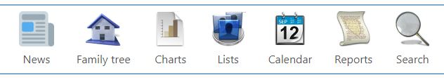
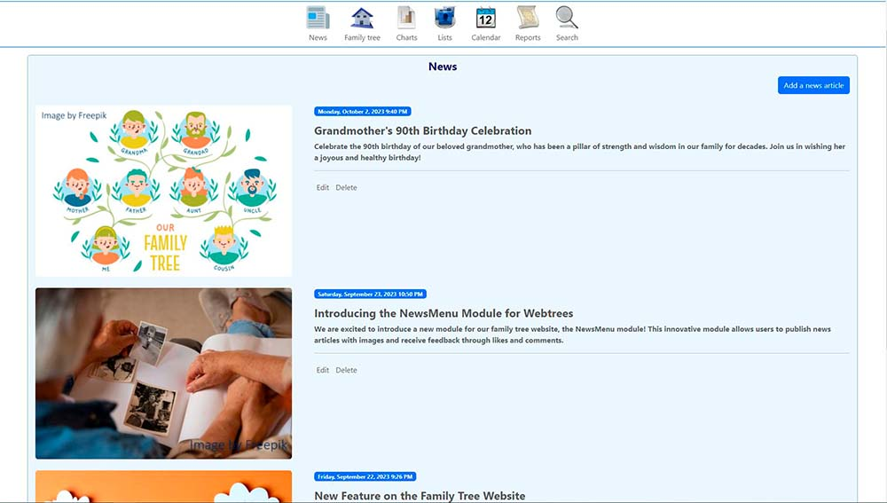
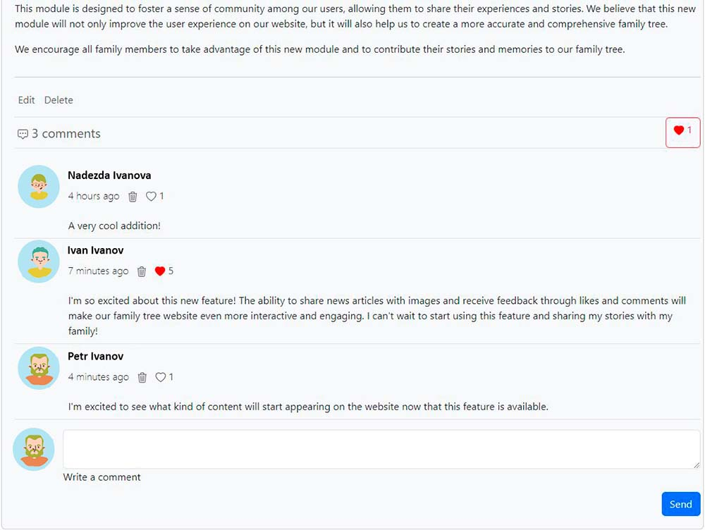
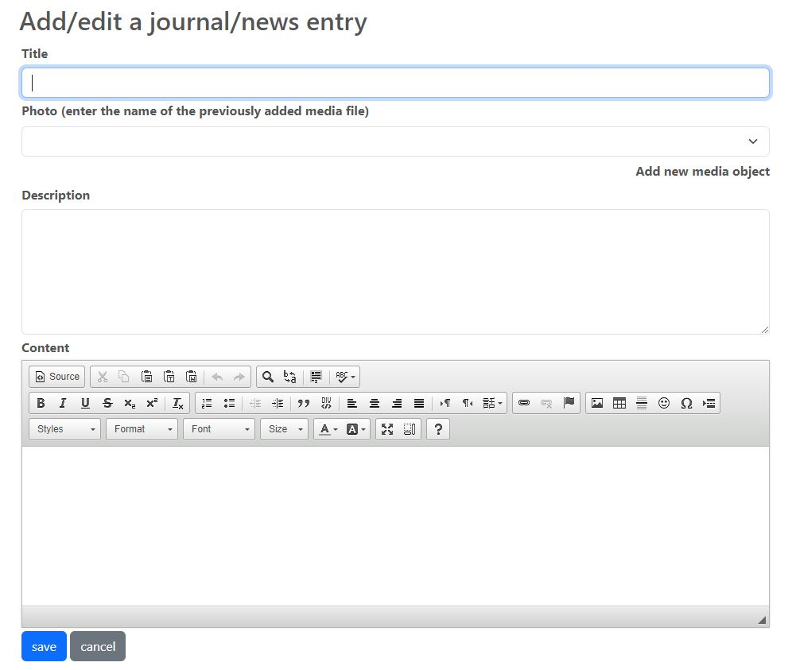

# webtrees module news menu

This [webtrees](https://www.webtrees.net/) custom module add an extra item to the main menu as a link to a webtrees news. 

## Contents
This Readme contains the following main sections

* [Warning](#warning)
* [Description](#description)
* [Screenshots](#screenshots)
* [Requirements](#requirements)
* [Installation](#installation)
* [Upgrade](#upgrade)
* [Support](#support)
* [License](#license)

## Warning

This module makes changes to the Webtrees database, the data entered through the module is not exported to GEDCOM files. Before installing the module on your main site, try to test it.

## Description

This custom module for webtrees introduces a news management system. It extends the functionality of the main menu by adding an extra item that serves as a portal to the news section. The news management system allows users to attach images to their news posts, enriching the content with visual elements. This feature not only provides a more engaging user experience but also promotes better content organization and presentation. Furthermore, the module includes a commenting system for news posts. This feature fosters interaction between users, allowing them to express their thoughts and opinions on the news. In addition, the module introduces a 'like' functionality for news posts. This allows users to express their approval or interest in a news post, providing another layer of engagement. Finally, the module provides the ability to schedule news posts for future dates. This feature allows users to plan their news content ahead of time, ensuring that their news is always timely and relevant.In conclusion, this module significantly enhances the news management capabilities of webtrees, providing a comprehensive solution for creating, managing, and interacting with news content. This module is inspired by a [jp-main-menu-manual](https://github.com/jpretired/jp-main-menu-manual) and [simple-menu-module](https://github.com/JustCarmen/webtrees-simple-menu)

## Screenshots

Screenshot of menu

Screenshot of the news list with images

Screenshot with comments to the news and reactions to them

Screenshot of the news addition page

## Requirements

This module requires **webtrees** version 2.1 or later.
This module has the same requirements as [webtrees#system-requirements](https://github.com/fisharebest/webtrees#system-requirements).

This module was tested with **webtrees** 2.1.17 version and all standarts themes.

## Installation

This section documents installation instructions for this module.

1. Download the [latest release](https://github.com/tywed/news-menu/releases/latest).
2. Unzip the package into your `webtrees/modules_v4` directory of your web server.
3. Rename the folder to `NewsMenu`. It's safe to overwrite the respective directory if it already exists.
4. Login to **webtrees** as administrator, go to Control Panel/Modules/Genealogy/Menus,
   and find the module. It will be called "News". Check if it has a tick for "Enabled".
5. Finally, click SAVE, to complete the configuration.

## Upgrade

To update simply replace the `news-menu`
files with the new ones from the latest release.

## Support

Issues: you can report errors raising an issue in this GitHub repository.

Forum: general webtrees support can be found at the [webtrees forum](http://www.webtrees.net/)

## License

* Copyright © 2023 Tywed 
* Copyright © 2022 Hermann Hartenthaler
* Copyright © 2020 Josef Prause 
* Derived from **webtrees** - © 2022 webtrees development team.

This program is free software: you can redistribute it and/or modify
it under the terms of the GNU General Public License as published by
the Free Software Foundation, either version 3 of the License, or
(at your option) any later version.

This program is distributed in the hope that it will be useful,
but WITHOUT ANY WARRANTY; without even the implied warranty of
MERCHANTABILITY or FITNESS FOR A PARTICULAR PURPOSE. See the
GNU General Public License for more details.

You should have received a copy of the GNU General Public License
along with this program. If not, see <http://www.gnu.org/licenses/>.

* * *
